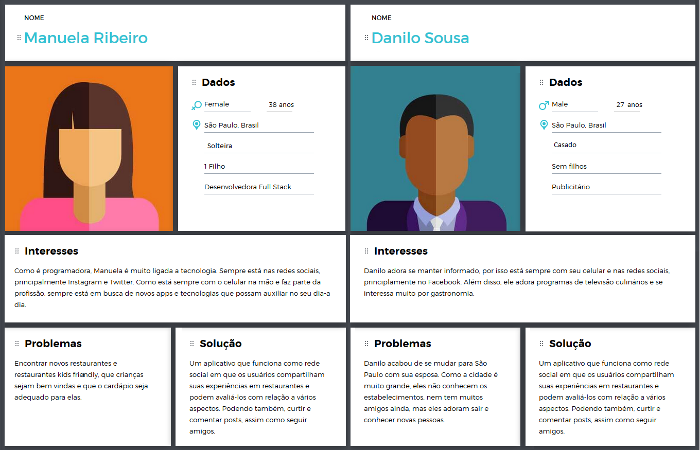

# Projeto Rede Social 

O Brasil é um dos campeões mundiais em tempo de permanência na rede, o internauta brasileiro fica, em média, nove horas e 14 minutos por dia conectado. Também segundo relatório da comScore, nosso tempo de permanência no ambiente online é de 9,7 horas por mês e a maior parte do tempo online dos brasileiros (36%) é gasto em mídias sociais. Por conta desse grande acesso, 92% das empresas possuem redes sociais para atingirem um publico maior e atrairem talentos, segundo relatório da Social Media Trends.  

Quando observamos as redes sociais mais populares, alguns dos tipos de posts mais comuns são relacionados a comidas, restaurantes e passeios. O hábito de comer fora de casa tem sido uma realidade cada vez mais presente na vida dos brasileiros e 34% dos brasileiros gastam com alimentação fora de casa, sendo consumido uma média de 25% da sua renda.  

# Fork Rank

Pensando nessa demanda criamos uma rede social chamada Fork Rank, ela possui elementos básicos de uma rede social: As pessoas podem se cadastrar e criar um perfil pessoal, nesse perfil é possível postar opiniões sobre restaurantes e comidas, os comentários podem ser públicos ou privados e também será implementada no futuro a funcionalidade de seguir pessoas para visualizar e curtir suas publicações.  

A nossa rede social é voltada para usuários que são ativos na rede sociais, apreciam culinária, gostam de expressar suas opiniões e conhecer pessoas.   

## Criamos 2 personas:

Descobrimos as necessidades dos usuários, buscando informações sobre quantidade e tipo de acesso nas redes sociais que são mais populares e quais sao as publicaoes preferidas para o nosso perfil de usuario.  

O nosso produto disponibiliza uma plataforma para os usuários comentarem sobre as suas experiencias gastronômicas e criarem uma rede de pessoas com interesses em comum, para lerem posts e dicas de restaurantes alem de poderem curtir e comentar as postagens. 

O objetivo dos usuários em nossa rede social é aumentar sua rede de amigos com gostos em comum pela culinária e também ler e postar dicas referentes a gastronomia em geral.  

As principais funcionalidades do produto são: cadastro de usuário, login, perfil pessoal, opção de postar publicamente ou de modo privado, curtir posts e seguir pessoas.  

Através do protótipo de media fidelidade no Marvel conseguimos efetuamos testes de usabilidade. 

[Para acessar o protótipo clique aqui!](https://marvelapp.com/6g1f8b7/screen/54741167) 

 

